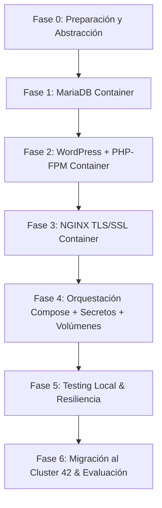

# 🗺️ Roadmap Hiperdetallado: Proyecto Inception (42 Madrid)

## 🎯 Objetivo General
Desarrollar, configurar y validar localmente la infraestructura multi-contenedor aislada y segura de **Inception** en tu equipo local (Ubuntu 24.04), garantizando una migración con **cero fricción** a la Máquina Virtual (Debian) del cluster de 42 Madrid.

---

## ⚡ Principios de Portabilidad (Local ➔ 42 Campus VM)

Para que el proyecto funcione idénticamente en tu portátil y en la VM del campus:
1. **Abstracción del Usuario/Rutas**: No harcodear `/home/rhiguita/...`. Usar la variable `${USER}` o resolver la ruta de datos dinámicamente mediante el `Makefile` y `.env`.
2. **Cero Artefactos en Git**: Solo se sube código fuente (`Dockerfiles`, scripts `.sh`, configuraciones `.conf`, `Makefile`, `docker-compose.yml`). Ningún certificado, volumen ni secreto se almacena en el repositorio.
3. **Construcción desde CERO**: Las imágenes se compilan con el flag `--build` desde las distribuciones oficiales requeridas (`debian:bookworm` / `debian:bullseye`).
4. **Dominio dinámico**: El dominio `<login>.42.fr` se parametriza en el `.env` (ej. `rhiguita.42.fr`).

---

## 📅 FASES DE IMPLEMENTACIÓN DETALLADAS



---

### 🔹 FASE 0: Preparación del Entorno Local y Abstracción de Variables
- [ ] **0.1. Mapeo de Host**:
  - Añadir en `/etc/hosts` de tu equipo local: `127.0.0.1 rhiguita.42.fr`.
- [ ] **0.2. Estructura Estándar de Carpetas**:
  ```text
  inception/
  ├── Makefile
  ├── secrets/                 # Ignorado en .gitignore
  └── srcs/
      ├── .env                 # Ignorado en .gitignore (se incluye .env.example)
      ├── docker-compose.yml
      └── requirements/
          ├── mariadb/
          │   ├── Dockerfile
          │   ├── conf/50-server.cnf
          │   └── tools/entrypoint.sh
          ├── nginx/
          │   ├── Dockerfile
          │   ├── conf/nginx.conf
          │   └── tools/entrypoint.sh
          └── wordpress/
              ├── Dockerfile
              ├── conf/www.conf
              └── tools/entrypoint.sh
  ```
- [ ] **0.3. Configuración del `Makefile` Raíz**:
  - Reglas obligatorias: `all`, `up`, `down`, `start`, `stop`, `status`, `clean`, `fclean`, `re`.
  - El `Makefile` debe verificar/crear los directorios `/home/${USER}/data/wordpress` y `/home/${USER}/data/mariadb` en el host antes de levantar Docker Compose.
- [ ] **0.4. Gestión de Secretos Locales**:
  - Crear script en `Makefile` o en herramientas locales para autogenerar archivos `.txt` en `secrets/` (`db_password.txt`, `db_root_password.txt`, `wp_admin_password.txt`).

---

### 🔹 FASE 1: Servicio MariaDB (Base de Datos)
- [ ] **1.1. Dockerfile de MariaDB**:
  - Basado en `debian:bookworm`.
  - Instalar `mariadb-server` y utilidades necesarias.
  - Exponer puerto interno `3306`.
- [ ] **1.2. Configuración (`50-server.cnf`)**:
  - Modificar `bind-address` a `0.0.0.0` para permitir conexiones desde la red de Docker.
- [ ] **1.3. Script de Inicialización (`entrypoint.sh`)**:
  - Leer contraseñas desde los archivos montados en `/run/secrets/`.
  - Inicializar la base de datos `mariadb-install-db`.
  - Crear la base de datos del proyecto (`MYSQL_DATABASE`) y el usuario de WordPress (`MYSQL_USER`) asignando privilegios `GRANT ALL PRIVILEGES`.
  - Asignar la contraseña del usuario `root` de MariaDB.
  - Arrancar MariaDB en primer plano (`mysqld_safe` o `mariadbd`).

---

### 🔹 FASE 2: Servicio WordPress + PHP-FPM (Servidor de Aplicación)
- [ ] **2.1. Dockerfile de WordPress**:
  - Basado en `debian:bookworm`.
  - Instalar `php-fpm`, `php-mysql`, `mariadb-client`, `curl`, `unzip`.
  - Instalar **WP-CLI** (`/usr/local/bin/wp`).
  - Exponer puerto interno `9000`.
- [ ] **2.2. Configuración PHP-FPM (`www.conf`)**:
  - Cambiar `listen = /run/php/php8.2-fpm.sock` a `listen = 9000` (escucha en TCP, no socket UNIX).
- [ ] **2.3. Script Entrypoint (`entrypoint.sh`)**:
  - Esperar hasta que MariaDB esté respondiendo en el puerto 3306 (`mariadb-admin ping`).
  - Si `/var/www/html/wp-config.php` no existe:
    - Ejecutar `wp core download --path=/var/www/html`.
    - Ejecutar `wp config create` usando la DB y contraseñas de `/run/secrets/`.
    - Ejecutar `wp core install` con URL `https://rhiguita.42.fr`, título, usuario admin y su contraseña.
    - Ejecutar `wp user create` para el segundo usuario requerido por el subject (rol suscriptor/autor).
  - Arrancar PHP-FPM en primer plano (`php-fpm8.2 -F`).

---

### 🔹 FASE 3: Servicio NGINX (HTTPS & Reverse Proxy)
- [ ] **3.1. Dockerfile de NGINX**:
  - Basado en `debian:bookworm`.
  - Instalar `nginx` y `openssl`.
  - Exponer puerto `443`.
- [ ] **3.2. Generación de Certificado SSL/TLS**:
  - Generar certificado autodfirmado mediante `openssl req` en `/etc/nginx/ssl/nginx.crt` y clave privada `/etc/nginx/ssl/nginx.key`.
- [ ] **3.3. Configuración (`nginx.conf`)**:
  - `listen 443 ssl;`
  - `ssl_protocols TLSv1.2 TLSv1.3;` (cumplimiento estricto del subject).
  - Directiva `server_name rhiguita.42.fr;`.
  - Redirección de archivos `.php` hacia el contenedor de WordPress: `fastcgi_pass wordpress:9000;`.
  - Configuración de `index index.php index.html;` y `root /var/www/html;`.

---

### 🔹 FASE 4: Orquestación General (`docker-compose.yml`)
- [ ] **4.1. Definición de Red**:
  - Red aislada tipo bridge: `inception_network`.
- [ ] **4.2. Definición de Volúmenes Nombrados con Rutas Locales**:
  ```yaml
  volumes:
    wordpress_data:
      driver: local
      driver_opts:
        type: none
        o: bind
        device: /home/${USER}/data/wordpress
    mariadb_data:
      driver: local
      driver_opts:
        type: none
        o: bind
        device: /home/${USER}/data/mariadb
  ```
- [ ] **4.3. Definición de Docker Secrets**:
  - Mapear los secretos desde `./secrets/*.txt` a la ubicación `/run/secrets/` de cada contenedor.

---

### 🔹 FASE 5: Validaciones Locales y Pruebas de Resiliencia
- [ ] **5.1. Verificación HTTPS**:
  - Acceder a `https://rhiguita.42.fr` en el navegador y comprobar certificado SSL.
- [ ] **5.2. Verificación de Persistencia**:
  - Crear un post o usuario en WordPress.
  - Ejecutar `make down` o `docker compose down`.
  - Ejecutar `make up`. Verificar que la entrada/post sigue existiendo.
- [ ] **5.3. Verificación de Aislamiento de Red**:
  - Probar que MariaDB y WordPress NO son accesibles directamente desde el host (los puertos 3306 y 9000 no deben estar abiertos en la máquina host).
- [ ] **5.4. Verificación de Protocolos TLS**:
  - Ejecutar `curl -I -v --tlsv1.2 https://rhiguita.42.fr` y `curl -I -v --tlsv1.3 https://rhiguita.42.fr`.
  - Probar TLSv1.1 (debe fallar).

---

### 🔹 FASE 6: Migración al Cluster de 42 Madrid y Evaluación
- [ ] **6.1. Clonado en la VM Debian de 42 Madrid**:
  - Abrir la VM oficial de 42 (o tu sesión en el campus).
  - Clonar el repositorio de Git.
- [ ] **6.2. Edición de `/etc/hosts` en la VM**:
  - `echo "127.0.0.1 rhiguita.42.fr" | sudo tee -a /etc/hosts`
- [ ] **6.3. Despliegue con `make`**:
  - Ejecutar `make` en la raíz del repositorio.
  - Comprobar que los contenedores compilan y levantan sin errores en el entorno del campus.
- [ ] **6.4. Simulación de Defensa**:
  - Revisar los comandos de inspección (`docker ps`, `docker inspect`, `docker network inspect`).
  - Explicar la diferencia entre VM y contenedores, secretos vs variables, y volúmenes vs bind mounts.
