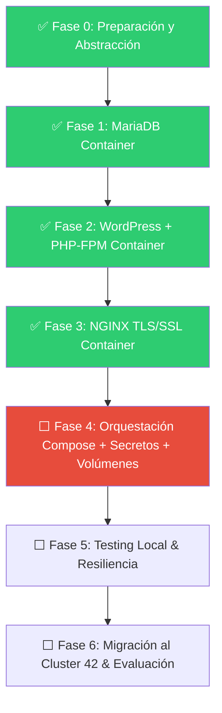

# 🗺️ Roadmap Hiperdetallado: Proyecto Inception (42 Madrid)

## 🎯 Objetivo General
Desarrollar, configurar y validar localmente la infraestructura multi-contenedor aislada y segura de **Inception** en tu equipo local (Ubuntu 24.04), garantizando una migración con **cero fricción** a la Máquina Virtual (Debian) del cluster de 42 Madrid.

---

## ⚡ Principios de Portabilidad (Local ➔ 42 Campus VM)

Para que el proyecto funcione idénticamente en tu portátil y en la VM del campus:
1. **Abstracción del Usuario/Rutas**: No harcodear `/home/rhiguita/...`. Usar la variable `${USER}` o resolver la ruta de datos dinámicamente mediante el `Makefile` (`DATA_PATH = /home/$(USER)/data`) y `.env`.
2. **Cero Artefactos en Git**: Solo se sube código fuente (`Dockerfiles`, scripts `.sh`, configuraciones `.conf`, `Makefile`, `docker-compose.yml`). Ningún certificado, volumen ni secreto se almacena en el repositorio.
3. **Construcción desde CERO**: Las imágenes se compilan con el flag `--build` desde las distribuciones oficiales requeridas (`debian:bookworm`).
4. **Dominio dinámico**: El dominio `<login>.42.fr` se parametriza en el `.env` (ej. `rhiguita.42.fr`).

---

## 📅 FASES DE IMPLEMENTACIÓN Y ESTADO DEL PROYECTO



---

### 🔹 FASE 0: Preparación del Entorno Local y Abstracción de Variables (✅ COMPLETADA)
- [x] **0.1. Mapeo de Host**:
  - Añadido en `/etc/hosts` de tu equipo local: `127.0.0.1 rhiguita.42.fr`.
- [x] **0.2. Estructura Estándar de Carpetas**:
  ```text
  inception/
  ├── Makefile
  ├── secrets/                 # Ignorado en .gitignore (.txt con passwords)
  └── srcs/
      ├── .env                 # Ignorado en .gitignore (se incluye .env.example)
      ├── docker-compose.yml   # Pendiente (Fase 4)
      └── requirements/
          ├── mariadb/
          │   ├── Dockerfile
          │   ├── conf/50-server.cnf
          │   └── tools/entrypoint.sh
          ├── nginx/
          │   ├── Dockerfile   # Pendiente (Fase 3)
          │   ├── conf/nginx.conf
          │   └── tools/entrypoint.sh
          └── wordpress/
              ├── Dockerfile
              ├── conf/www.conf
              └── tools/entrypoint.sh
  ```
- [x] **0.3. Configuración del `Makefile` Raíz**:
  - Reglas obligatorias: `all`, `up`, `down`, `start`, `stop`, `status`, `logs`, `clean`, `fclean`, `re`.
  - El `Makefile` verifica/crea automáticamente los directorios `/home/$(USER)/data/wordpress` y `/home/$(USER)/data/mariadb` en el host (`init_dirs`).
- [x] **0.4. Gestión de Secretos Locales**:
  - Archivos `.txt` en `secrets/` (`db_password.txt`, `db_root_password.txt`, `wp_admin_password.txt`).

---

### 🔹 FASE 1: Servicio MariaDB (Base de Datos) (✅ COMPLETADA)
- [x] **1.1. Dockerfile de MariaDB** (`srcs/requirements/mariadb/Dockerfile`):
  - Basado en `debian:bookworm`.
  - Instalación limpia de `mariadb-server`.
  - Expone el puerto interno `3306`.
- [x] **1.2. Configuración (`50-server.cnf`)**:
  - `bind-address = 0.0.0.0` para permitir conexiones TCP desde el contenedor WordPress en la red aislada Docker.
  - Caracteres UTF-8 (`utf8mb4`).
- [x] **1.3. Script de Inicialización (`entrypoint.sh`)**:
  - Lee contraseñas desde `/run/secrets/db_password` y `/run/secrets/db_root_password`.
  - Inicializa `/var/lib/mysql` con `mariadb-install-db`.
  - Instancia temporal con `mariadbd --skip-networking` para bootstrap seguro.
  - Crea base de datos (`MYSQL_DATABASE`) y usuario (`MYSQL_USER`) asignando `GRANT ALL PRIVILEGES ON db.* TO 'user'@'%'`.
  - Arranca MariaDB en primer plano con `exec mariadbd` (PID 1).

---

### 🔹 FASE 2: Servicio WordPress + PHP-FPM (Servidor de Aplicación) (✅ COMPLETADA)
- [x] **2.1. Dockerfile de WordPress** (`srcs/requirements/wordpress/Dockerfile`):
  - Basado en `debian:bookworm`.
  - Instala `php8.2-fpm`, `php8.2-mysql`, `php8.2-xml`, `php8.2-curl`, `php8.2-mbstring`, `php8.2-zip`, `php8.2-gd`, `php8.2-intl`, `mariadb-client`, `curl`, `ca-certificates`.
  - Instala **WP-CLI** en `/usr/local/bin/wp`.
  - Expone el puerto interno `9000`.
- [x] **2.2. Configuración PHP-FPM (`www.conf`)**:
  - Escucha TCP `listen = 9000` (remueve el socket UNIX `/run/php/php8.2-fpm.sock`).
  - Configura `clear_env = no` para pasar las variables de entorno de Docker a PHP.
  - Gestor de procesos dinámico (`pm = dynamic`, `pm.max_children = 5`).
- [x] **2.3. Script Entrypoint (`entrypoint.sh`)**:
  - Healthcheck de dependencia: Bucle `until mariadb-admin ping -h mariadb ...` esperando a que MariaDB responda en puerto 3306.
  - Si `/var/www/html/wp-config.php` no existe:
    - Ejecuta `wp core download`.
    - Ejecuta `wp config create` apuntando a `mariadb:3306` con secretos de `/run/secrets/`.
    - Ejecuta `wp core install` con dominio `https://${DOMAIN_NAME}`, título, usuario administrador (`WP_ADMIN_USER`) y password (`wp_admin_password`).
    - Crea el segundo usuario requerido (`WP_USER`, rol suscriptor).
  - Ajusta los permisos de `/var/www/html` a `www-data:www-data`.
  - Arranca PHP-FPM en primer plano con `exec php-fpm8.2 -F` (PID 1).

---

### 🔹 FASE 3: Servicio NGINX (HTTPS & Reverse Proxy) (✅ COMPLETADA)
- [x] **3.1. Dockerfile de NGINX** (`srcs/requirements/nginx/Dockerfile`):
  - Basado en `debian:bookworm`.
  - Instala `nginx` y `openssl`.
  - Expone únicamente el puerto `443` (HTTP/80 estrictamente prohibido por subject).
- [x] **3.2. Script Entrypoint (`tools/entrypoint.sh`)**:
  - Lee `DOMAIN_NAME` del entorno de Docker.
  - Genera certificado autofirmado SSL con `openssl req -x509 -nodes -days 365 -newkey rsa:2048` en `/etc/nginx/ssl/` si no existe.
  - Subject del cert: `/C=ES/ST=Madrid/L=Madrid/O=42Madrid/OU=Student/CN=${DOMAIN}`.
  - Inyecta el dominio en `nginx.conf` mediante `sed -i "s/__DOMAIN_NAME__/${DOMAIN}/g"`.
  - Valida la configuración con `nginx -t` antes de arrancar.
  - Arranca en primer plano con `exec nginx -g "daemon off;"` (PID 1).
- [x] **3.3. Configuración NGINX (`conf/nginx.conf`)**:
  - `listen 443 ssl;` / `listen [::]:443 ssl;`.
  - TLS estricto: `ssl_protocols TLSv1.2 TLSv1.3;`.
  - Placeholder `__DOMAIN_NAME__` sustituido en runtime por el entrypoint.
  - Root: `/var/www/html` con `index index.php index.html;`.
  - `try_files $uri $uri/ /index.php?$args;` para WordPress permalinks.
  - Bloque FastCGI para procesamiento de PHP:
    ```nginx
    location ~ \.php$ {
        include fastcgi_params;
        fastcgi_pass wordpress:9000;
        fastcgi_param SCRIPT_FILENAME $document_root$fastcgi_script_name;
        fastcgi_intercept_errors on;
    }
    ```
  - Bloque de seguridad: `location ~ /\. { deny all; }`.

---

### 🔹 FASE 4: Orquestación General (`srcs/docker-compose.yml`) (⬜ PENDIENTE)
- [ ] **4.1. Definición de Red**:
  - Red aislada tipo bridge: `inception_network`.
- [ ] **4.2. Definición de Volúmenes Nombrados con Bind Mounts**:
  ```yaml
  volumes:
    wordpress_data:
      driver: local
      driver_opts:
        type: none
        o: bind
        device: /home/${USER}/data/wordpress
    mariadb_data:
      driver: local
      driver_opts:
        type: none
        o: bind
        device: /home/${USER}/data/mariadb
  ```
- [ ] **4.3. Definición de Docker Secrets**:
  ```yaml
  secrets:
    db_password:
      file: ../secrets/db_password.txt
    db_root_password:
      file: ../secrets/db_root_password.txt
    wp_admin_password:
      file: ../secrets/wp_admin_password.txt
  ```
- [ ] **4.4. Definición de Servicios**:
  - `mariadb`: build, restart `always`, red `inception_network`, volumen `mariadb_data:/var/lib/mysql`, env_file `.env`, secrets (`db_password`, `db_root_password`).
  - `wordpress`: build, restart `always`, red `inception_network`, volumen `wordpress_data:/var/www/html`, env_file `.env`, secrets (`db_password`, `wp_admin_password`), `depends_on: mariadb`.
  - `nginx`: build, restart `always`, red `inception_network`, puertos `"443:443"`, volumen `wordpress_data:/var/www/html`, `depends_on: wordpress`.

---

### 🔹 FASE 5: Validaciones Locales y Pruebas de Resiliencia (⬜ PENDIENTE)
- [ ] **5.1. Verificación HTTPS**:
  - Acceder a `https://rhiguita.42.fr` en el navegador y comprobar certificado SSL.
- [ ] **5.2. Verificación de Persistencia de Datos**:
  - Crear una entrada/post en WordPress.
  - Ejecutar `make down` o `docker compose down`.
  - Ejecutar `make up`. Verificar que la entrada sigue existiendo.
  - Probar `make fclean` (debe borrar `/home/$(USER)/data/` completamente).
- [ ] **5.3. Verificación de Aislamiento de Red**:
  - Comprobar que solo el puerto `443` está expuesto en la máquina host (`netstat -tulpn` / `nmap`).
  - Verificar que ni 3306 ni 9000 son accesibles directamente desde el host.
- [ ] **5.4. Verificación de Protocolos TLS**:
  - `curl -I -v --tlsv1.2 https://rhiguita.42.fr` (éxito).
  - `curl -I -v --tlsv1.3 https://rhiguita.42.fr` (éxito).
  - `curl -I -v --tlsv1.1 https://rhiguita.42.fr` (debe rechazar conexión).

---

### 🔹 FASE 6: Migración al Cluster de 42 Madrid y Evaluación (⬜ PENDIENTE)
- [ ] **6.1. Clonado en la VM Debian de 42 Madrid**.
- [ ] **6.2. Edición de `/etc/hosts` en la VM**: `127.0.0.1 rhiguita.42.fr`.
- [ ] **6.3. Despliegue con `make`**.
- [ ] **6.4. Simulación de Defensa**:
  - Inspección con `docker ps`, `docker inspect`, `docker network inspect`.
  - Explicación teórica: VM vs Contenedor, Secrets vs Env Vars, Bind Mounts vs Named Volumes.

---

## 📜 Historial de Commits del Proyecto

| Hash | Mensaje de Commit | Cambios Clave |
|---|---|---|
| *(pendiente)* | `feat(nginx): add Dockerfile, nginx.conf, and entrypoint script` | Fase 3 completada (NGINX TLS 1.2/1.3 + reverse proxy → wordpress:9000) |
| `5316be2` | `docs(roadmap): expand technical detail for phases 0-6` | Roadmap con detalle técnico completo |
| `6444c97` | `docs(roadmap): mark Phase 2 WordPress+PHP-FPM as complete` | Actualización de Roadmap |
| `f1acfa1` | `feat(wordpress): add Dockerfile, PHP-FPM config, and entrypoint script` | Fase 2 completada (WordPress + PHP-FPM + WP-CLI) |
| `6d3744b` | `feat(mariadb): add Dockerfile, server config, and entrypoint script` | Fase 1 completada (MariaDB 0.0.0.0 + Secrets) |
| `fb4dc45` | `Fase0 estructura de carpetas y configuraciones iniciales path.. etc` | Estrutura de directorios y Makefile |
| `880dc9d` | `Estructuración y roadmap del proyecto inception` | Creación del roadmap inicial |
